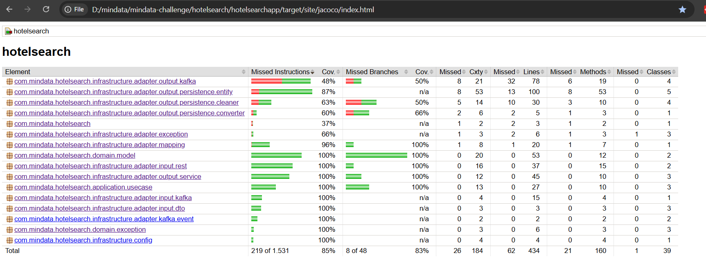

# APis para b&uacute;squedas de hoteles (Challenge T&eacute;cnico) 

## Descripci&oacute;n del Challenge

Este challenge consiste en desarrollar una aplicación con Spring Boot que gestione búsquedas de hoteles mediante REST y Kafka.

Los endpoints desarrollados son:
- **POST /hotelapi/search:**
Recibe una b&uacute;squeda de hotel (hotelId, fechas y edades de hu&eacute;spedes) y devuelve un searchId único.
- **GET /hotelapi/count:**
Recibe un parámetro obligatorio searchId y devuelve la búsqueda junto con el n&uacute;mero de búsquedas id&eacute;nticas registradas en la base de datos.
Ejemplo:
    ```bash
    http://localhost:8080/hotelapi/count?searchId=0TMPuDOyhyu4RyQU7g8xFV83gempeF9bZsbA7-MLS78
    ```
## Instalaci&oacute;n
1. **Clonar el repositorio:**
    ```bash
     git clone https://github.com/jesusalbertobaute/hotelsearch.git
     cd hotelsearch
    ```
2. **Crear carpeta "secrets" con archivos de credenciales:**
   secrets/
       oracle_password.txt          # Password para la Base de Datos Oracle
       oracle_user_password.txt     # Password de usuario para conexión a Oracle

   La aplicación leer&aacute; estas credenciales para conectarse a la base de datos de forma segura.

3. **Levantar Docker Compose:**
   ```bash
     docker compose up
    ```
   Esto tardar&aacute; un tiempo dependiendo de los recursos del ordenador.
   Despu&eacute;s de que se levante los contenedores la aplicaci&oacute;n estar&aacute; disponible en http://localhost:8080.
   Por lo tanto las urls de los endpoints serán:
   1. Para POST /hotelapi/search:
      ```bash
         curl --location 'http://localhost:8080/hotelapi/search' \
         --header 'Content-Type: application/json' \
         --data '{
            "hotelId": "1234aBc",
            "checkIn": "29/12/2023",
            "checkOut": "31/12/2023",
            "ages": [29, 1, 3, 30, 5]
         }'
    ```
  2. Para GET /hotelapi/count:
      ```bash
     curl --location 'http://localhost:8080/hotelapi/count?searchId=0TMPuDOyhyu4RyQU7g8xFV83gempeF9bZsbA7-MLS78'
      ``` 

## Notas del Desarrollador
1. Publicación de eventos en Kafka (Patrón Outbox).
   - Al ejecutar POST /hotelapi/search, el payload de la b&uacute;squeda se guarda primero en la tabla OUTBOX_EVENT.
   - Un servicio scheduler llamado SearchKafkaProducer lee peri&oacute;dicamente esta tabla y publica los eventos en Kafka.
   - Ventajas del patrón Outbox:
        - Garantiza consistencia entre la base de datos y Kafka.
        - Evita p&eacute;rdida de eventos en caso de fallos.
        - Permite reintentos automáticos de eventos pendientes.
2. Idempotencia en el consumidor
   - Cada evento consumido genera un eventId &uacute;nico (UUID) y se registra en la tabla EVENT_PROCESSED.
   - Antes de procesar un evento, se verifica si ya existe en EVENT_PROCESSED; si ya fue procesado, se ignora.
   - Esto asegura que los eventos se procesen una sola vez, evitando duplicados en la base de datos.
3. Idempotencia de searchId
   - El searchId se calcula a partir del contenido completo del payload.
   - Se respeta el orden de la lista ages al generar el hash.
   - B&uacute;squedas id&eacute;nticas con mismo contenido y orden generan el mismo searchId.
4. Mantenimiento de tablas de eventos
   - Para evitar que las tablas EVENT_PROCESSED y OUTBOX_EVENT crezcan indefinidamente, se implementan los servicios scheduler:
     - EventProcessedCleanupScheduler
     - OutboxEventCleanupScheduler
    - Estos servicios eliminan peri&oacute;dicamente los registros que ya fueron procesados o enviados.
5. Persistencia y conteo de b&uacute;squedas
    -  Los payloads se almacenan en la tabla RESERVATION_SEARCH.
    -  La columna count se actualiza según los POST /hotelapi/search.
    -  Se usan hilos virtuales para actualizar concurrentemente, mediante el servicio UpdateSearchCountService.

6. La cobertura final de los test fu&eacute; superior a 80%
